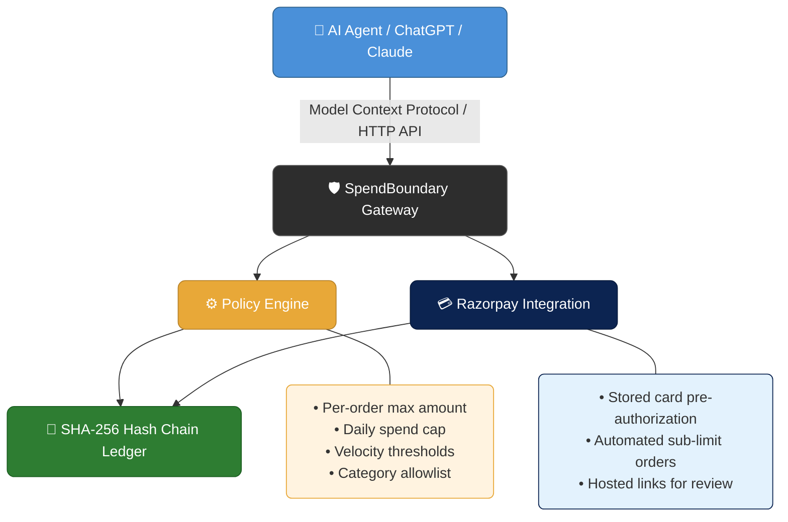

<<<<<<< HEAD
# SpendBoundary 🛡️

## Policy-Gated Payments & Financial Firewall for Autonomous AI Agents

> **Let AI shop autonomously. Keep the human in control.**

SpendBoundary is an open-standard, merchant-side financial trust layer and policy gateway for AI agents. By integrating with the **Model Context Protocol (MCP)** and **Razorpay**, SpendBoundary allows LLMs (Claude Desktop, ChatGPT Custom GPTs, LangChain agents) to research products and request checkouts without ever gaining direct access to unconstrained credit cards or raw payment keys.

Every transaction passes through a deterministic server-side policy gate:

```text
ALLOW (< ₹1,000) ──> Tokenized Card Mandate (Zero-OTP Autonomous Debit)
REVIEW (> ₹1,000) ─> Halts AI & Delivers Hosted Razorpay Payment Link
DENY (Violations) ─> Blocked at Gateway (Zero Payment Calls)
```

Every decision, tool invocation, human approval, and payment event is cryptographically sealed in a **tamper-evident SHA-256 Merkle audit trail**.

---

## 🚀 Key Features

- 🔌 **Model Context Protocol (MCP) Standard:** Native tool-calling server for Claude Desktop and ChatGPT Custom GPT Actions (`search_catalogue`, `get_product`, `get_policy_limits`, `request_checkout`, `check_approval_status`, `cancel_request`).
- 💳 **Tokenized Card Mandate Pre-Authorization:** 
  - Generates a live ₹1 setup link on Razorpay when no card is on file.
  - Real-time API reconciliation polling automatically captures card details (e.g. `RuPay •••• 1005`) without needing public webhook tunnels.
  - Autonomous zero-OTP checkouts for sub-limit purchases (< ₹1,000) keep the conversation context completely uninterrupted.
- ⚖️ **Deterministic Policy Firewall:** Server-side price authority (calculated in integer paise) with velocity rate limiting, category whitelisting, daily spend caps, and single-order ceilings.
- 👤 **Human Review Gateway:** Medium/high-value purchases (> ₹1,000) trigger human approval with live Hosted Razorpay Payment Links (`https://rzp.io/rzp/...`).
- 🔗 **SHA-256 Merkle Audit Ledger:** Append-only cryptographic hash chain with interactive tamper injection to demonstrate instant mathematical fraud detection.
- ⚡ **Real-Time Financial Dashboard:** Interactive glassmorphic control room with live policy sliders, cart telemetry, approvals queue, and 1-click spend reset.

---

## 🛠️ Quick Start & Local Setup

### Prerequisites
- Node.js 18+ installed
- Git installed
- Razorpay Test Key & Secret (optional — deterministic mock gateway fallback is enabled if keys are omitted)

### 1. Installation
```bash
# Clone repository
git clone https://github.com/AkshitJain2007/SpendBoundary.git
cd SpendBoundary

# Install dependencies
npm install

# Initialize Prisma SQLite Database
npx prisma db push
```

### 2. Environment Variables (`.env.local`)
Create a `.env.local` file in the root directory:
```env
DATABASE_URL="file:./dev.db"
PORT=3000

# Razorpay Test Mode Credentials (Optional)
RAZORPAY_KEY_ID="rzp_test_your_key_id"
RAZORPAY_KEY_SECRET="your_key_secret"
RAZORPAY_WEBHOOK_SECRET="spendboundary_demo_secret"
```

### 3. Run Development Server
```bash
npm run dev
```
Open [http://localhost:3000](http://localhost:3000) to access the SpendBoundary Control Room.

### 4. Run Automated Test Suite
```bash
npm test
```

---

## 🤖 Connecting AI Agents via Model Context Protocol (MCP)

### Option A: Claude Desktop Integration
Add SpendBoundary to your `claude_desktop_config.json` (located at `%APPDATA%\Claude\claude_desktop_config.json` on Windows or `~/Library/Application Support/Claude/claude_desktop_config.json` on macOS):
=======
<div align="center">

# 🛡️ SpendBoundary

**Policy enforcement and payment authorization gateway for autonomous AI agents.**

Intercepts checkout requests from language models, verifies spending limits and category rules, records an immutable SHA-256 audit ledger, and executes payments via Razorpay.

[](#)
[](#)
[](#)
[](#)
[](#)

</div>

---

## 📐 Architecture



---

### 🚦 Policy Decisions

When an agent requests a purchase, the policy engine recalculates prices from the product database and returns one of three outcomes:

| Status | Condition | Action |
| :---: | :--- | :--- |
| ✅ **ALLOW** | The order satisfies all limits. | The system completes the order using the agent's pre-authorized card mandate token and logs the transaction. |
| ⚠️ **REVIEW** | The order exceeds the auto-approval threshold or cumulative daily limit. | The system creates an approval record and generates a hosted Razorpay payment link for manual authorization. |
| 🚫 **DENY** | The order violates category restrictions, single-order caps, or velocity limits. | The system halts the checkout and records the violation in the audit trail. |

---

## 🔧 MCP Tools Reference

SpendBoundary exposes standard tools over the Model Context Protocol (`/api/mcp` or `scripts/mcp-server.ts`):

| Tool Name | Parameters | Description |
| :--- | :--- | :--- |
| `search_catalogue` | `query`, `category`, `limit` | Searches the merchant product database for matching items and prices. |
| `get_policy_limits` | `agentId` | Returns current spending limits, velocity rules, category allowlists, and payment mandate status. |
| `request_checkout` | `items`, `reason`, `agentId` | Submits a cart for policy evaluation, auto-debits sub-limit orders, or generates a review payment link. |
| `check_approval_status` | `requestId` | Queries the status of an order and reconciles live payment status from Razorpay. |
| `cancel_request` | `requestId`, `reason` | Cancels a pending purchase request and records the cancellation in the audit ledger. |
| `get_payment_mandate_status` | `agentId` | Returns the card mandate details or generates a setup authorization link. |
| `setup_payment_mandate` | `agentId`, `maxSingleDebitRupees` | Registers or updates a payment card mandate for an agent. |
| `revoke_payment_mandate` | `agentId` | Deactivates an agent's stored payment card mandate. |
| `reset_demo_state` | *none* | Resets test transactions and daily spending counters to zero. |

---

## 🌐 HTTP API Routes

| Endpoint | Method | Description |
| :--- | :---: | :--- |
| `/api/mcp` | `POST` | JSON-RPC 2.0 endpoint for MCP clients (Claude Desktop, custom GPT actions). |
| `/api/catalogue` | `GET`, `POST` | Product listing and merchant inventory management. |
| `/api/policy` | `GET`, `PUT` | Reads and updates spending boundaries and threshold rules. |
| `/api/checkout` | `POST` | Direct REST checkout entry point with policy evaluation. |
| `/api/approvals` | `GET`, `POST` | Fetches pending approvals and allows merchants to approve or reject requests. |
| `/api/audit` | `GET` | Returns the cryptographic SHA-256 audit event chain. |
| `/api/audit/tamper` | `POST` | Diagnostic endpoint to simulate and detect ledger tampering. |
| `/api/payments/webhook` | `POST` | Webhook receiver for Razorpay payment capture events. |
| `/api/demo/reset-spend` | `POST` | Resets daily spend totals and test transactions for demo testing. |

---

## 🚀 Getting Started

### Prerequisites

- **Node.js** 18.x or higher
- **npm** 9.x or higher

### Installation

**1.** Clone the repository and install dependencies:

```bash
git clone https://github.com/AkshitJain2007/SpendBoundary.git
cd SpendBoundary
npm install
```

**2.** Configure environment variables:

Create a `.env.local` file in the root directory:

```env
DATABASE_URL="file:./dev.db"
NEXT_PUBLIC_APP_URL="http://localhost:3000"

# Razorpay Credentials (Test Mode)
RAZORPAY_KEY_ID="rzp_test_your_key_id"
RAZORPAY_KEY_SECRET="your_key_secret"
RAZORPAY_WEBHOOK_SECRET="your_webhook_secret"
```

**3.** Initialize the SQLite database and seed test data:

```bash
npm run db:push
npm run db:seed
```

**4.** Start the development server:

```bash
npm run dev
```

> 🌍 The application runs on `http://localhost:3000`.

---

## 🖥️ Claude Desktop MCP Configuration

To connect Claude Desktop to the SpendBoundary MCP server, add the following to `claude_desktop_config.json`:
>>>>>>> d693aa37d54777a3bb34cb10e0cca9a5b68f26f9

```json
{
  "mcpServers": {
    "spendboundary": {
      "command": "npx",
      "args": [
        "-y",
        "tsx",
<<<<<<< HEAD
        "<ABSOLUTE_PATH_TO_SPENDBOUNDARY>/scripts/mcp-server.ts"
=======
        "<PROJECT_ROOT_PATH>/scripts/mcp-server.ts"
>>>>>>> d693aa37d54777a3bb34cb10e0cca9a5b68f26f9
      ]
    }
  }
}
```
<<<<<<< HEAD
Restart Claude Desktop. Claude now has direct access to `@SpendBoundary` tools!

### Option B: ChatGPT Custom GPT Integration
1. In ChatGPT, create a Custom GPT.
2. Go to **Configure $\rightarrow$ Actions $\rightarrow$ Create new action**.
3. Import the OpenAPI specification from `http://localhost:3000/api/mcp` or use the JSON schema provided in the dashboard's **MCP Guide** tab.

---

## 🧪 Verified Demo Scenarios

| Scenario | Input Command in AI Chat | Result & Experience |
|---|---|---|
| **1. Card Mandate Check** | `@SpendBoundary What is my mandate status?` | If no card stored, AI outputs a **live ₹1 Razorpay setup link**. |
| **2. Active Reconciliation** | *User pays ₹1 on Razorpay link* | SpendBoundary verifies payment and stores card (**RuPay •••• 1005**). |
| **3. Autonomous Sub-Limit** | `@SpendBoundary Buy ₹350 notebook` | **ALLOW:** Auto-debited from saved card with **Zero OTP** in chat. |
| **4. Single-Order Overspend** | `@SpendBoundary Buy ₹8,000 ergonomic chair` | **DENY:** Exceeds ₹2,000 limit; zero payment calls created. |
| **5. Blocked Category** | `@SpendBoundary Buy ₹5,000 crypto mining key` | **DENY:** Category not whitelisted; immediately blocked. |
| **6. Velocity Burst** | *Submit 4 rapid checkout requests* | **DENY:** Velocity limit (max 3 per 60s) triggers on 4th attempt. |
| **7. Daily Spend Cap** | *Accumulated spend reaches ₹5,000* | **DENY:** 24h daily spend boundary reached. |
| **8. Human Review Gate** | `@SpendBoundary Buy ₹1,500 desk lamp` | **REVIEW:** Halts AI; delivers a **Hosted Razorpay Payment Link**. |
| **9. Tamper Detection** | *Click "Simulate Tamper" in Audit tab* | Ledger recalculates hash chain and reports broken block index. |

---

## 🔒 Security Architecture & Financial Invariants

1. **Integer Paise Authority:** All financial calculations are executed strictly in integer paise ($1\text{ INR} = 100\text{ Paise}$). Floating-point values are forbidden in the policy engine.
2. **Server-Side Price Authority:** Cart totals are re-computed on the server using database product prices. The AI cannot alter item prices in the cart payload.
3. **No Direct Gateway Access:** AI agents can only propose actions through MCP tools. They never receive gateway API keys, customer CVVs, or write access to the database.
4. **Append-Only Merkle Chain:** All state transitions and policy decisions are hashed into an immutable cryptographic chain:
   $$\text{eventHash} = \text{SHA256}(\text{previousHash} + \text{payloadJson} + \text{eventType} + \text{createdAt})$$

---

## 👥 Authors & License

Developed for the **VIT Hackathon 2026**.  
Built with Next.js 15, Prisma, SQLite, Tailwind CSS, and Razorpay API.  
Licensed under the **MIT License**.
=======

---

## 🧪 Testing

Run unit tests for the policy evaluation engine and verification rules:

```bash
npm test
```

Build production bundles:

```bash
npm run build
```

---

<div align="center">

*Built for the age of autonomous AI commerce.* 🤖💸

</div>
>>>>>>> d693aa37d54777a3bb34cb10e0cca9a5b68f26f9
