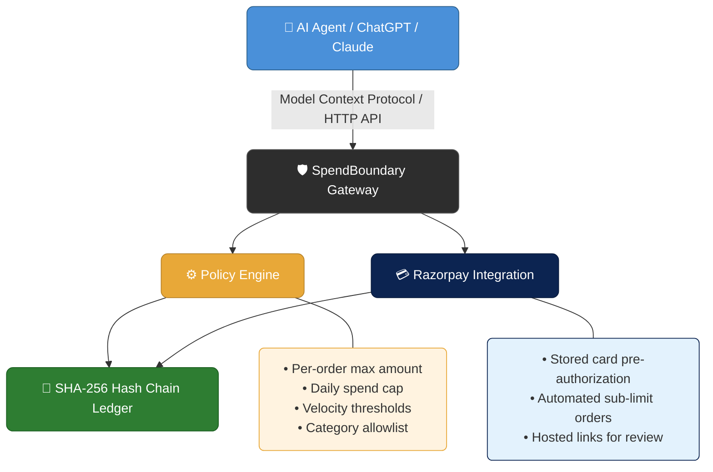

<div align="center">

# 🛡️ SpendBoundary

**Policy enforcement and payment authorization gateway for autonomous AI agents.**

Intercepts checkout requests from language models, verifies spending limits and category rules, records an immutable SHA-256 audit ledger, and executes payments via Razorpay.

[](#)
[](#)
[](#)
[](#)
[](#)

</div>

---

## 📐 Architecture



---

### 🚦 Policy Decisions

When an agent requests a purchase, the policy engine recalculates prices from the product database and returns one of three outcomes:

| Status | Condition | Action |
| :---: | :--- | :--- |
| ✅ **ALLOW** | The order satisfies all limits. | The system completes the order using the agent's pre-authorized card mandate token and logs the transaction. |
| ⚠️ **REVIEW** | The order exceeds the auto-approval threshold or cumulative daily limit. | The system creates an approval record and generates a hosted Razorpay payment link for manual authorization. |
| 🚫 **DENY** | The order violates category restrictions, single-order caps, or velocity limits. | The system halts the checkout and records the violation in the audit trail. |

---

## 🔧 MCP Tools Reference

SpendBoundary exposes standard tools over the Model Context Protocol (`/api/mcp` or `scripts/mcp-server.ts`):

| Tool Name | Parameters | Description |
| :--- | :--- | :--- |
| `search_catalogue` | `query`, `category`, `limit` | Searches the merchant product database for matching items and prices. |
| `get_policy_limits` | `agentId` | Returns current spending limits, velocity rules, category allowlists, and payment mandate status. |
| `request_checkout` | `items`, `reason`, `agentId` | Submits a cart for policy evaluation, auto-debits sub-limit orders, or generates a review payment link. |
| `check_approval_status` | `requestId` | Queries the status of an order and reconciles live payment status from Razorpay. |
| `cancel_request` | `requestId`, `reason` | Cancels a pending purchase request and records the cancellation in the audit ledger. |
| `get_payment_mandate_status` | `agentId` | Returns the card mandate details or generates a setup authorization link. |
| `setup_payment_mandate` | `agentId`, `maxSingleDebitRupees` | Registers or updates a payment card mandate for an agent. |
| `revoke_payment_mandate` | `agentId` | Deactivates an agent's stored payment card mandate. |
| `reset_demo_state` | *none* | Resets test transactions and daily spending counters to zero. |

---

## 🌐 HTTP API Routes

| Endpoint | Method | Description |
| :--- | :---: | :--- |
| `/api/mcp` | `POST` | JSON-RPC 2.0 endpoint for MCP clients (Claude Desktop, custom GPT actions). |
| `/api/catalogue` | `GET`, `POST` | Product listing and merchant inventory management. |
| `/api/policy` | `GET`, `PUT` | Reads and updates spending boundaries and threshold rules. |
| `/api/checkout` | `POST` | Direct REST checkout entry point with policy evaluation. |
| `/api/approvals` | `GET`, `POST` | Fetches pending approvals and allows merchants to approve or reject requests. |
| `/api/audit` | `GET` | Returns the cryptographic SHA-256 audit event chain. |
| `/api/audit/tamper` | `POST` | Diagnostic endpoint to simulate and detect ledger tampering. |
| `/api/payments/webhook` | `POST` | Webhook receiver for Razorpay payment capture events. |
| `/api/demo/reset-spend` | `POST` | Resets daily spend totals and test transactions for demo testing. |

---

## 🚀 Getting Started

### Prerequisites

- **Node.js** 18.x or higher
- **npm** 9.x or higher

### Installation

**1.** Clone the repository and install dependencies:

```bash
git clone https://github.com/AkshitJain2007/SpendBoundary.git
cd SpendBoundary
npm install
```

**2.** Configure environment variables:

Create a `.env.local` file in the root directory:

```env
DATABASE_URL="file:./dev.db"
NEXT_PUBLIC_APP_URL="http://localhost:3000"

# Razorpay Credentials (Test Mode)
RAZORPAY_KEY_ID="rzp_test_your_key_id"
RAZORPAY_KEY_SECRET="your_key_secret"
RAZORPAY_WEBHOOK_SECRET="your_webhook_secret"
```

**3.** Initialize the SQLite database and seed test data:

```bash
npm run db:push
npm run db:seed
```

**4.** Start the development server:

```bash
npm run dev
```

> 🌍 The application runs on `http://localhost:3000`.

---

## 🖥️ Claude Desktop MCP Configuration

To connect Claude Desktop to the SpendBoundary MCP server, add the following to `claude_desktop_config.json`:

```json
{
  "mcpServers": {
    "spendboundary": {
      "command": "npx",
      "args": [
        "-y",
        "tsx",
        "<PROJECT_ROOT_PATH>/scripts/mcp-server.ts"
      ]
    }
  }
}
```

---

## 🧪 Testing

Run unit tests for the policy evaluation engine and verification rules:

```bash
npm test
```

Build production bundles:

```bash
npm run build
```

---

<div align="center">

*Built for the age of autonomous AI commerce.* 🤖💸

</div>
